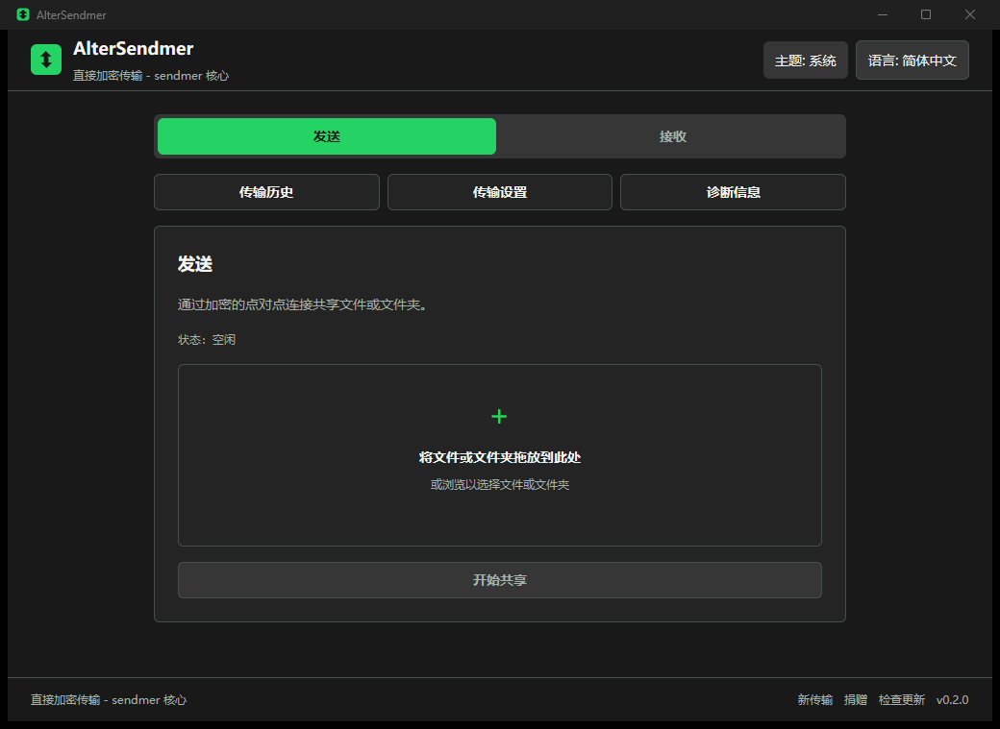

<div align="center">


# AlterSendmer

Native peer-to-peer file transfer built with Rust, GPUI, and sendmer.

[](https://github.com/bruceblink/alter-sendmer/actions/workflows/ci.yml)
[](https://github.com/bruceblink/alter-sendmer/releases/latest)
[](LICENSE)

</div>

AlterSendmer transfers files and folders directly between peers without uploading them to third-party
cloud storage. The GPUI application replaces the retired Tauri/WebView client previously maintained
at [`bruceblink/alter-sendme`](https://github.com/bruceblink/alter-sendme).



## Features

- Direct encrypted transfer over the sendmer iroh/QUIC stack, with NAT traversal and relay fallback.
- File and folder sending through the native picker or drag-and-drop.
- Ticket copy, paste, and save actions with explicit sender and receiver cancellation.
- Live progress, folder file counts, completion summaries, failure recovery, and transfer history.
- Versioned transfer events with session IDs, ordered phases, structured error summaries, and
  retry-aware history diagnostics.
- System, dark, and light themes plus a dropdown containing all 21 bundled languages.
- Relay, retry, download-chunk, and persistent sender upload-limit preferences.
- Diagnostics, signed update checks, and donation links.
- One native Rust process with no Node.js, Tauri, React, or WebView runtime.

## Install

Download the Windows NSIS installer or portable ZIP, Linux AppImage or DEB, and macOS DMG from
[GitHub Releases](https://github.com/bruceblink/alter-sendmer/releases/latest). `SHA256SUMS` covers
the published packages. The application verifies the minisign signature embedded in `latest.json`
before installing an update; update bundles are selected by operating system and architecture.

## Development

Requirements:

- Rust `1.95` or newer
- Native GPUI build prerequisites for the target platform
- `cargo-packager` 0.11.8 when producing native packages

```powershell
cargo fmt --all -- --check
cargo check --workspace --all-targets --locked
cargo clippy --workspace --all-targets --locked -- -D warnings
cargo test --workspace --locked
cargo run
```

The application pins GPUI and `gpui_platform` to the same reviewed Zed revision. It consumes the
published [`sendmer`](https://crates.io/crates/sendmer) `0.8.0` crate through its opaque
`SendHandle` lifecycle API and versioned event envelope, so a clean checkout does not depend on a
sibling directory or Git revision.
The optional upload limit is entered in MiB/s and converted to sendmer's shared payload bytes/s limit;
`Unlimited` remains the default and the desktop client does not implement a separate limiter.

## Packaging

```powershell
cargo install cargo-packager --version 0.11.8 --locked
cargo packager --release --formats nsis --out-dir dist/windows-x86_64
.\scripts\package-portable.ps1 -Version 0.3.0 -SkipBuild
```

Use `--formats appimage,deb` on Linux and `--formats app,dmg` on macOS. Release tags build and sign
all three operating-system packages, generate `latest.json` and `SHA256SUMS`, then publish the
assets. The minisign private key is stored only in GitHub Actions secrets; trusted Windows and macOS
code-signing certificates can be added independently when available.

## Documentation

- [Design](docs/DESIGN.md)
- [Development plan](docs/DEVELOPMENT_PLAN.md)
- [Migration from the Tauri client](docs/MIGRATION.md)

The repeatable Windows visual check is `scripts/capture-ui-acceptance.ps1`. It captures the sender,
receiver, and transfer settings at both default and minimum window sizes, plus the complete language
dropdown.

## Privacy and License

Transfer history contains metadata only and never file contents. AlterSendmer is licensed under
[AGPL-3.0](LICENSE). See the [privacy policy](PRIVACY.md) for the local data and network services used
by the native application.

Support development through [GitHub Sponsors](https://github.com/sponsors/bruceblink) or
[Buy Me a Coffee](https://buymeacoffee.com/bruceblink).
