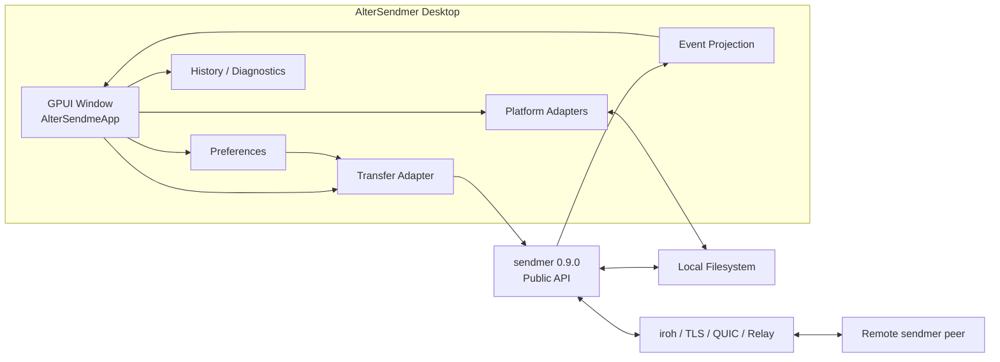

# AlterSendmer 主线设计与开发计划

本文是 AlterSendmer 唯一的主线设计与开发计划。它合并了原 GPUI 设计说明与阶段开发计划，
并与 `sendmer v0.9.0` 的公开契约对齐。旧 Tauri 客户端迁移说明继续独立保留，但不再承担
当前架构或未来计划。

## 1. 术语表与命名约定

| 规范名称 | English / 缩写 | 职责边界 | 不代表什么 |
| --- | --- | --- | --- |
| 核心传输层 | sendmer Core | 负责 ticket、点对点传输、重试、限速、路径安全和资源清理 | 不负责 GPUI 状态、本地化或更新界面 |
| 桌面客户端 | AlterSendmer Desktop | 负责 GPUI 交互、配置、状态投影、历史和平台集成 | 不复制协议、缓存数据库或限速器 |
| 传输适配器 | Transfer Adapter | 将桌面配置、取消和事件映射到 sendmer 公开 API | 不是第二套传输实现 |
| 传输票据 | Ticket | 允许接收方连接并请求内容的 bearer capability | 不是账号、长期授权或云端分享链接 |
| 传输会话 | Transfer Session | 一次 send 或 receive 的应用层生命周期 | 不是单条 QUIC 连接或 UI 页面 |
| 事件信封 | Event Envelope | 承载 schema 版本、会话 ID、序号、阶段和事件载荷 | 不参与控制流，也不替代函数返回值 |
| 结构化错误 | Transfer Error | 提供稳定错误码、失败阶段、可重试属性和安全摘要 | 不是本地化文案或完整内部错误链 |
| 上传速率上限 | Upload Rate Limit | 一个 sender 对所有接收方共享的 payload 上限 | 不是每个 peer 的独立配额或精确 QoS |
| 持久接收缓存 | Persistent Receive Cache | 由 sendmer 保留已验证数据，供后续 receive 进程恢复 | 不是云存储、永久会话或跨设备同步 |

公开产品名统一为 `AlterSendmer`。内部 crate/进程名 `alter-sendme-gpui`、安装标识
`top.likanug.alter-sendme` 和旧 `AlterSendme` 配置目录只为升级兼容保留，不出现在新的产品
名称、窗口标题或发行资产名称中。

## 2. 产品边界与当前基线

当前发布基线是 `AlterSendmer v0.5.0`，通过 crates.io 依赖 `sendmer = "0.9.0"`。桌面客户端
提供不依赖账号、服务器或云端存储的原生点对点文件传输。传输票据是 bearer capability：
拿到有效票据即可接收，因此界面和文档必须提醒用户只通过可信渠道分享。

桌面客户端负责：

- 文件/目录选择、拖放、ticket 输入与剪贴板、保存位置和系统 reveal。
- 发送/接收状态、进度、取消、重试、历史、诊断、主题和 21 种语言。
- 将 relay、重试、上传上限和持久缓存偏好映射到 sendmer 公开选项。
- 原生安装包、签名更新清单和平台发布体验。

桌面客户端不负责：

- iroh/QUIC 协议、ticket 格式、路径校验、原子导出、缓存布局、锁或 prune 规则。
- 账号、云端文件存储、后台同步、多租户控制面或自建 relay 运维。
- 使用本地 path、Git revision 或提交哈希绕过 sendmer 正式版本发布顺序。

## 3. 总体架构与依赖方向



依赖只能从桌面客户端指向 sendmer 公开 API。事件从核心传输层投影回 UI，但控制流仍以
异步任务的返回值和取消句柄为准。桌面客户端不得读取 sendmer 私有临时目录、manifest、
FsStore、Router 或底层 connection/request ID。

## 4. 应用状态与并发模型

`AlterSendmeApp` 是唯一 UI 状态机，持有当前工作区、选择路径、ticket、偏好、历史、提示和主题。
异步任务只通过 `WeakEntity` 回到 GPUI 主线程；每次传输分配 generation，旧任务完成时不得覆盖
新会话状态。

发送状态：

```text
Idle -> Preparing -> Sharing -> Metadata -> Transporting -> Finalizing -> Completed
                         \-> Stopping -> Idle
                         \-> Failed -> Retry
```

接收状态：

```text
Idle -> Connecting -> Metadata -> Transporting -> Exporting -> Finalizing -> Completed
                 \-> Stopping -> Idle
                 \-> Failed -> Retry
```

- 发送端持有 opaque `SendHandle`，直到用户停止共享或应用退出；资源关闭顺序由 sendmer 保证。
- 接收端持有 cancellation sender；取消只发出优雅取消信号，等待核心任务完成清理后再重置 UI。
- 应用退出先停止 sender，再取消并等待 receiver，不能先删除核心正在使用的目录。
- completed、failed、cancelled 互斥；失败状态保留安全摘要和可重试属性，不展示内部错误链。

## 5. 传输适配器契约

### 5.1 配置映射

| 桌面偏好 | sendmer 映射 | UI 规则 |
| --- | --- | --- |
| Relay 模式 | `SendOptions` / `ReceiveOptions` relay 配置 | 使用明确选项，不展示底层地址结构 |
| 重试与分块 | `ReceiveRetryPolicy` | 无效值在启动任务前拒绝 |
| 上传上限 | `max_upload_rate_bytes_per_sec` | 输入 `1..10240 MiB/s`，checked multiplication 转为 bytes/s；不限速为 `None` |
| 持久缓存 | `ReceiveCacheOptions` | 默认启用；新条目 TTL 为 `1 / 7 / 30` 天，默认 7 天 |
| 清理过期缓存 | `prune_receive_cache` | 只报告 removed/retained/active/unknown，不宣称清空全部缓存 |

上传上限是一个 sender 对所有接收方共享的 payload 平均上限，不包含全部 QUIC、Bao 或 relay
开销。桌面客户端不实现第二套 limiter，也不将它描述为精确线路 QoS。

持久缓存目录由桌面客户端在系统 cache 根下派生并传给 sendmer；桌面客户端不解析其中数据。
失败或取消保留已验证范围，成功导出删除对应条目。TTL 变更只影响之后创建的新条目；prune
保留活动、未过期、损坏和未来 schema 条目。

### 5.2 事件与错误投影

传输适配器实现 `sendmer::EventEmitter`，经无锁 channel 把事件交给 UI。消费者先校验
`schema_version`，再确认同一 `session_id` 和严格递增 `sequence`，最后按 `phase` 与载荷更新状态。

- `started`、`progress` 和 `file_names` 是非终态。
- `completed`、`failed`、`cancelled` 是唯一终态。
- 未知 schema、重复序号或序号缺口进入安全失败状态，不猜测事件含义。
- `TransferError.code` 驱动本地化摘要，`phase` 驱动失败位置，`retryable` 决定是否提供重试。
- 日志和历史不得持久化完整 ticket、绝对路径、节点密钥或底层连接标识。

历史保存在应用数据目录的 `history.json`，只包含角色、展示路径、大小、耗时、平均速度、时间、
结果，以及可选 session ID、错误码和阶段；新增字段保持旧文件反序列化兼容。

## 6. 交互与视觉规范

- 默认窗口 `1024x720`，最小 `760x560`；内容区滚动，固定控件不得因状态或翻译改变布局尺寸。
- 发送/接收是唯一的主任务分段导航；历史、传输设置和诊断是低强调次级工具。
- 接收空闲态固定为三步：`1` 传输票据、`2` 保存位置、`3` 开始接收。
- 票据输入使用 GPUI 原生文本输入，支持输入法、选择、键盘粘贴和长文本；粘贴与浏览是次级动作。
- 接收主按钮是唯一宽主按钮：无票据时禁用，失败时原位变为重试，传输中变为停止。
- 帮助内容只在展开后出现，不与接收按钮竞争，也不复制票据输入提示。
- relay、重试、下载分块、上传上限和持久缓存集中在传输设置；二元值用开关，枚举用选项控件，
  数值使用稳定宽度输入。
- 主题和语言使用紧凑控件；语言浮层在最上层并独立滚动，21 个 locale 均有核心导航与设置文案。
- 任何传输进行中都禁用会改变资源语义的选择、tab 切换和配置动作。

界面验收至少覆盖 `1024x720` 与 `760x560` 的发送、接收和设置页，以及语言浮层。长票据、
禁用态、失败重试、长翻译和帮助展开需有可重复检查，不能只凭编译通过宣称视觉完成。

## 7. 平台、更新与发布

| 平台 | 发布资产 |
| --- | --- |
| Windows x86_64 | NSIS 安装器、portable ZIP、更新归档 |
| Linux x86_64 | AppImage、DEB、更新归档 |
| macOS Apple Silicon | app 更新归档、DMG |

更新归档由 cargo-packager 使用同一 minisign 信任链签名；`latest.json` 按 `OS-ARCH` 映射下载
地址、签名和安装格式。客户端只在签名验证通过后进入安装路径；启动时静默检查，用户主动检查
时才展示最新状态或错误。

CI 在 Windows、Ubuntu 和 macOS 执行 fmt、check、Clippy 和 tests。Release 必须在三个原生
runner 上构建并上传资产，不能用交叉编译代替平台打包验收。Release 正文由 tag 提交范围生成，
重跑同一 tag 时幂等更新。

## 8. 已完成阶段与版本矩阵

| 桌面版本 | sendmer 版本 | 已完成范围 |
| --- | --- | --- |
| `v0.3.0` | `0.7.0` | opaque `SendHandle`、上传速率配置、接收页初次层级收敛 |
| `v0.4.0` | `0.8.0` | 版本化事件、结构化错误、历史诊断字段和三平台发布 |
| `v0.5.0` | `0.9.0` | 三步接收工作流、持久接收缓存开关/TTL/prune、完整本地化与视觉验收 |

`v0.5.0` 是本阶段收尾版本。它只消费 sendmer 已发布能力，不引入账号、云存储、后台同步、
内核级网络故障注入或跨设备永久续传。

## 9. 下一主线与跨项目协调

下一桌面版本不预先承诺新的核心协议。工作按以下顺序进入：

### A10.1 独立桌面质量改进

- 完善长票据、失败重试、帮助展开、最小窗口和高 DPI 的自动截图入口。
- 增强键盘焦点、AccessKit 标签、诊断导出和更新失败恢复，不扩大日志隐私范围。
- 为偏好迁移、历史兼容、缓存映射和退出清理持续补回归。

这些改进不需要 sendmer 新版本，可按独立补丁或桌面次版本交付。

### A10.2 消费 sendmer v0.10.0

只有 sendmer 正式发布候选能力后才开始适配：

- 会话过期、最大接收方数量和主动撤销映射为明确控制与状态。
- 版本化文件 manifest 若支持空目录、非 UTF-8、权限或时间戳，桌面端只展示选择与结果，
  不自行解释 wire schema。
- 新错误码、事件 schema 或缓存格式先完成 contract migration，再更新 UI 和历史兼容。

### A10.3 第二产品方向

后台 daemon、跨设备同步、账号、云端文件托管和多租户控制面需要独立产品设计、认证、持久
状态、冲突解决和运维方案。它们不进入 AlterSendmer 一次性传输主线，也不能由 GUI 私自扩展
sendmer ticket 语义。

## 10. 质量门禁与发布顺序

每个独立功能提交前至少执行：

```text
cargo fmt --all -- --check
cargo check --workspace --all-targets --locked
cargo clippy --workspace --all-targets --all-features --locked -- -D warnings
cargo test --workspace --all-features --locked
```

受影响界面必须增加 Windows 默认/最小窗口截图验收；打包变更还需运行 portable 与相应原生
packager rehearsal。版本 tag 只能指向全部门禁通过的提交。

跨项目发布顺序固定为：

1. sendmer 完成功能、契约、测试、文档和版本提交。
2. sendmer 发布 crate 与 GitHub Release，并确认 crates.io 可解析。
3. AlterSendmer 使用正式版本号升级，完成适配、contract tests、三平台 CI 和视觉验收。
4. 发布 AlterSendmer；不得使用本地 path 或 Git revision 绕过顺序。

## 11. 文档维护规则

- 本文件是 AlterSendmer 架构、UI 规范、版本矩阵和未来计划的唯一主线来源。
- README 只保留用户能力、安装、开发入口和公开边界；`MIGRATION.md` 只记录旧 Tauri 客户端迁移。
- 每次 sendmer 或 AlterSendmer 发布后同步更新第 2、8、9 节，并核对 sendmer 依赖版本。
- 不再新增按单个功能拆分的长期设计文档；复杂功能先在本文件中冻结边界，再在代码/PR 中记录
  实施细节，避免形成多个互相漂移的“当前计划”。
